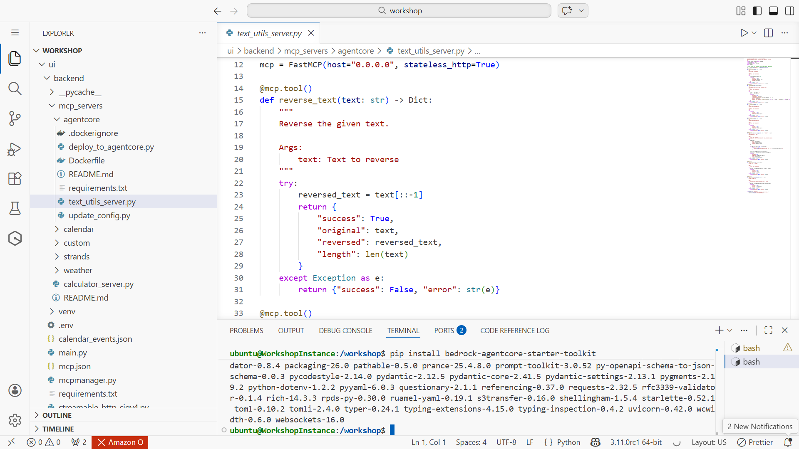
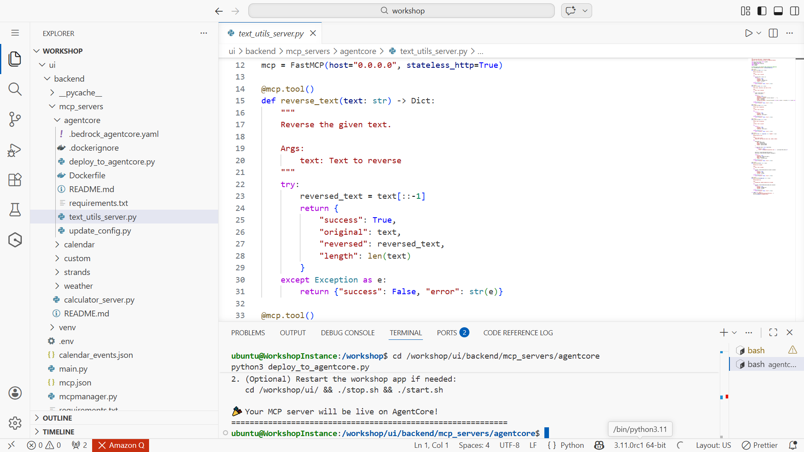
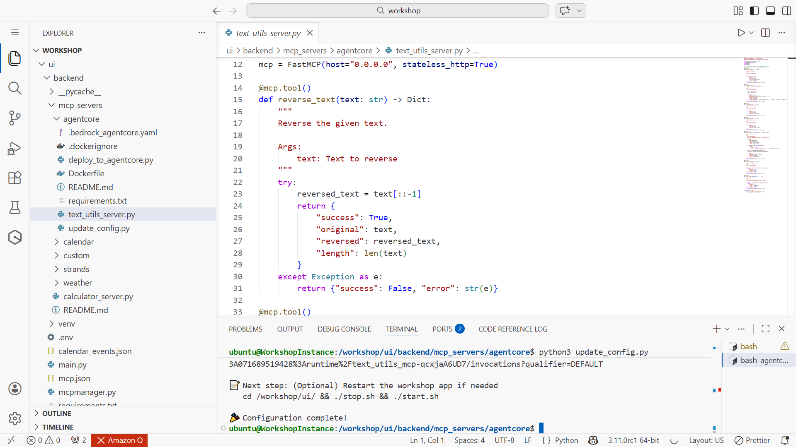
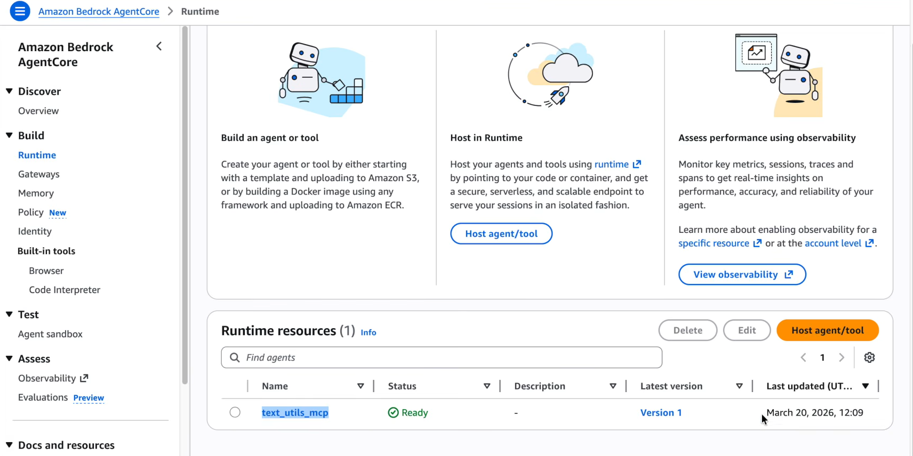
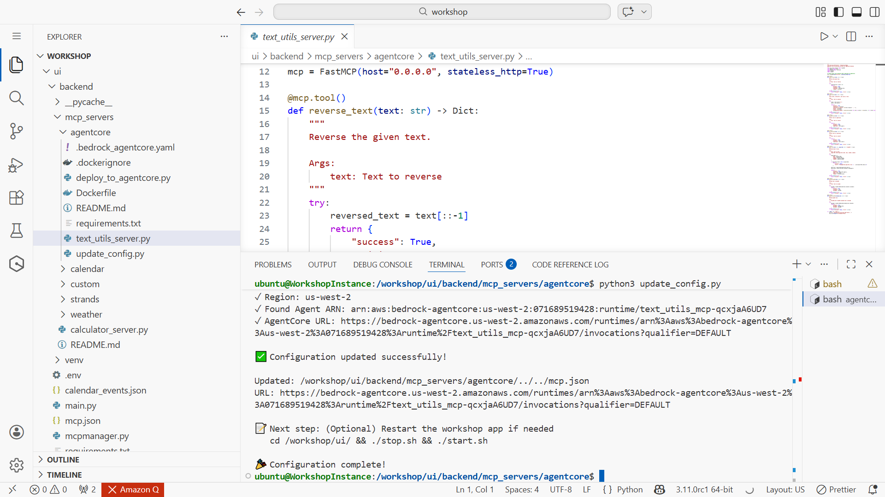

# Secure MCP Agent Integration

Secure agent-tool communication using the Model Context Protocol (MCP) with deployment on Amazon Bedrock AgentCore. This project demonstrates structured tool invocation, controlled agent interactions, and secure integration patterns for agentic AI systems.

## 🎯 Objectives
- Implement an MCP server for agent-to-tool communication
- Enable structured and secure tool invocation
- Integrate the MCP workflow with AWS AgentCore
- Validate agent interactions with external tools

## ⚙️ Key Implementation Steps
- Implemented MCP server using Python
- Exposed tools through MCP decorators
- Integrated agent workflows with AgentCore runtime
- Tested secure agent-tool interaction

## ⚡ Key Features
- Structured MCP-based agent communication  
- Controlled tool invocation by AI agents  
- Secure architecture for agent-tool integration  

## 🔧 Technologies
Python • Model Context Protocol (MCP) • Amazon Bedrock AgentCore

## 📸 Implementation Evidence

### Code Implementation

### Server Development

### Agent Execution

### AgentCore Interface

### Deployment Output

## 📚 Use Case
Demonstrates secure AI agent integration patterns relevant to cloud security automation, AI system governance, and intelligent infrastructure monitoring.

## 🙏🏼 Acknowledgment
Completed as part of BeSA Week 5: Model Context Protocol in Practice.
