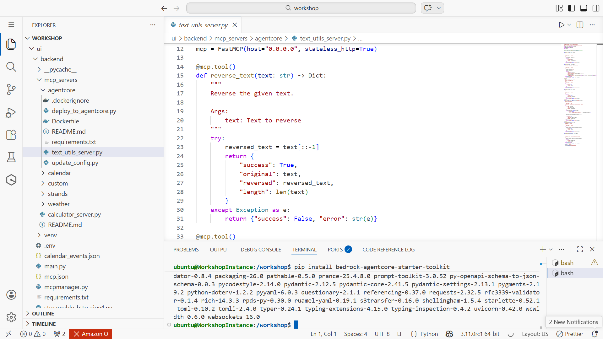
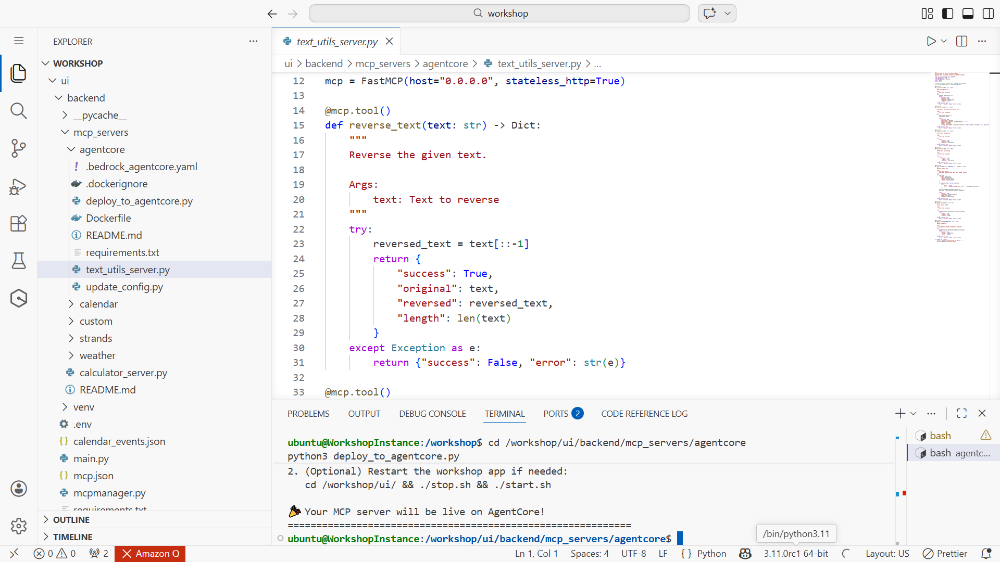
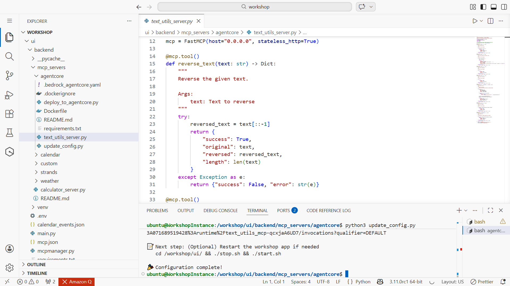
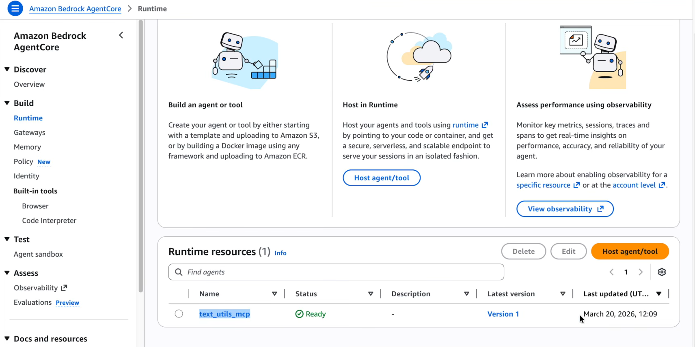
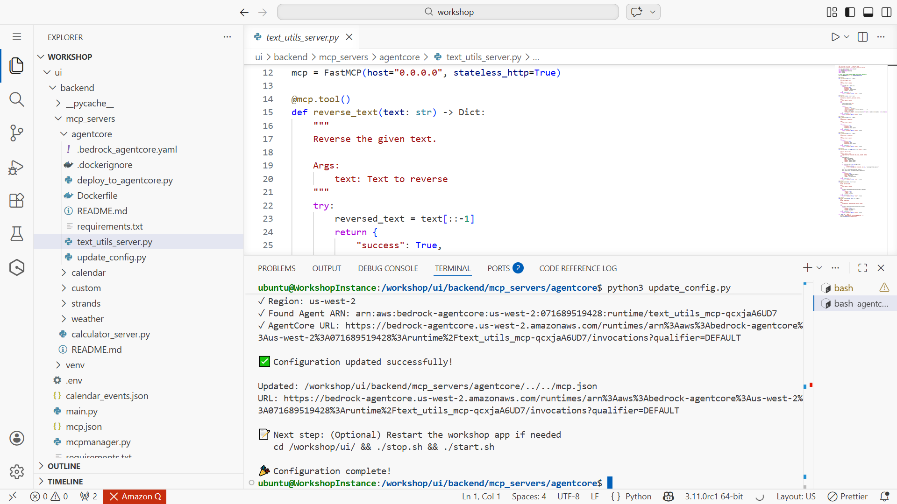
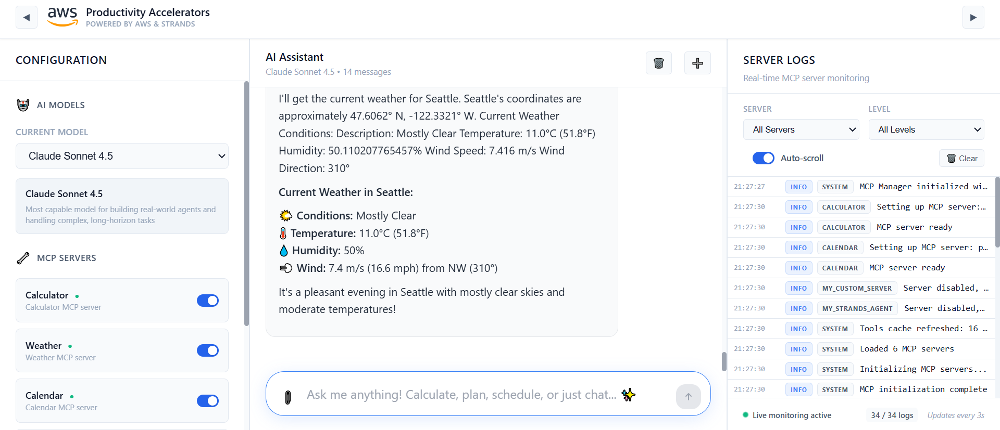

# Secure MCP Agent Integration

This project presents a security-focused implementation of agent-to-tool communication using the Model Context Protocol (MCP) and Amazon Bedrock AgentCore.

The implementation focuses on establishing an authenticated and controlled integration path between an AI agent and external tool capabilities, covering MCP server development, authenticated gateway access, runtime deployment, and execution validation.

---

## 🛡️ Security Boundary

The MCP layer provides a defined integration boundary between the agentic application and external tool capabilities.

Instead of coupling the agent directly to individual external services, tool capabilities are exposed through MCP interfaces and accessed through a controlled integration path. Authentication and gateway-mediated access provide a defined point for regulating agent-to-tool communication, while runtime execution provides visibility into the resulting service activity.

This separation supports more controlled, traceable integration between AI agents and external systems.

---

## 🔐 Security Engineering

The implementation incorporates the following security-focused controls and design decisions:

- **Established** structured agent-to-tool communication through MCP.
- **Implemented** authenticated access to the AgentCore Gateway using JWT bearer tokens.
- **Controlled** MCP tool discovery and invocation through the gateway integration.
- **Separated** agent logic from direct external service integration.
- **Applied** controlled execution boundaries between the agent and external tools.
- **Enabled** runtime visibility into MCP service initialisation and execution activity.

---

## ⚙️ System Architecture
The integration follows a defined agent-to-tool execution path:

**AI Agent → MCP Client → Authenticated AgentCore Gateway → MCP Tools / External Services**

The deployed MCP service operates within Amazon Bedrock AgentCore Runtime, providing a cloud-hosted execution environment for the integration.

The architecture separates:
- **Agent interaction** — the AI agent initiates tool requests through an MCP client.
- **Authentication** — JWT-based authentication is used when establishing access to the gateway.
- **Tool integration** — MCP provides the structured interface between the agent and available tools.
- **Runtime execution** — the MCP service is deployed to AgentCore Runtime.
- **Validation and observability** — runtime activity is validated through deployment status, execution results, and service logs.

---

## 🛠️ Engineering Implementation
The implementation consists of four primary engineering stages:

### 1. MCP Service Implementation
A Python-based MCP service was developed to expose tool capabilities through the MCP interface.

The service defines the tool interaction layer used by the agent rather than embedding external service calls directly within the agent application.

### 2. Authenticated Gateway Integration
The MCP client was integrated with Amazon Bedrock AgentCore Gateway using JWT bearer-token authentication.

This establishes an authenticated communication path for agent access to the gateway and subsequent MCP tool discovery.

### 3. Runtime Deployment
The MCP service was containerised and deployed to Amazon Bedrock AgentCore Runtime.

Python-based deployment and configuration scripts were used to register and configure the deployed runtime within the application environment.

### 4. Runtime Validation
The deployed integration was validated through runtime initialisation, service readiness, tool execution, and runtime log inspection.

This provided evidence that the MCP service could operate within the deployed AgentCore environment and participate in live agent-to-tool execution.

---

## 📊 Engineering Outcomes

- **Implemented** a Python/FastMCP service providing an MCP-based tool interface.
- **Established** authenticated agent access to the AgentCore Gateway using JWT bearer tokens.
- **Integrated** MCP tool discovery and invocation with the AgentCore environment.
- **Containerised and deployed** the MCP service to Amazon Bedrock AgentCore Runtime.
- **Automated** runtime deployment and configuration through Python-based deployment scripts.
- **Registered and configured** the deployed runtime for application use.
- **Validated** successful runtime initialisation and service readiness.
- **Demonstrated** live agent-to-tool execution within the deployed environment.
- **Verified** MCP service activity through runtime logs and execution telemetry.
- **Established** a reusable security-focused integration pattern for AI agent tool access.

---

## 🔧 Technologies

Python • FastMCP • Model Context Protocol (MCP) • Amazon Bedrock AgentCore • JWT Authentication

---

## 📸 Implementation Evidence

### MCP Service Implementation

### MCP Server Development

### Authenticated Agent Execution

### AgentCore Runtime

### Deployment Validation

### Runtime Validation

**The runtime evidence demonstrates operational validation of the deployed MCP integration, including agent-to-tool execution, MCP initialisation and service readiness, three enabled MCP servers, and 34/34 monitored log events.**

---

### Future extension: portable signed execution evidence

This is a future design consideration and is not implemented or live-validated in
the current proof of concept.

The current implementation documents security controls within the originating
environment, including authenticated gateway access, MCP agent-to-tool boundaries,
runtime deployment, execution validation, service logs, and observability.

For selected consequential tool actions, a future extension could produce a
portable, cryptographically signed receipt when execution evidence needs to be
shared outside the originating runtime trust boundary. A receipt could bind:

- a tool and runtime or execution reference;
- a canonicalised digest of the materialised request that executed;
- a result or artefact digest;
- a trace or correlation reference;
- status and timestamp; and
- an identified signing-key reference.

This could support tamper-evident verification that an identified signing key
signed a selected claim and that the signed representation was not subsequently
altered after export.

It would not establish that the original caller was properly authenticated or
authorised, that the runtime was uncompromised, that a tool action was safe or
correct, or that an external side effect occurred as claimed.

Any future implementation would need to address trust assumptions,
canonicalisation, privacy and data minimisation, key custody, rotation and
revocation, retention, and the downstream verifier's policy. This pattern should
be considered selectively for consequential actions rather than applied to every
MCP request.

This consideration arose from
[Issue #1](https://github.com/CliffordEdewor/secure-mcp-agent-integration/issues/1)

---

## 🔗 Context

This project forms a focused MCP security integration within a broader Agentic AI security architecture.

See the broader system:

https://github.com/CliffordEdewor/agentic-ai-security-bedrock-strands.git

---

## 📚 Application

The implementation demonstrates security-focused agent-to-tool integration patterns applicable to:

- AI security automation
- Controlled AI tool access
- AI system governance
- Cloud security workflows
- Intelligent infrastructure monitoring

---

## 📄 License

This project is provided for demonstration and portfolio purposes, documenting the engineering implementation of an MCP-based secure agent-to-tool integration.
